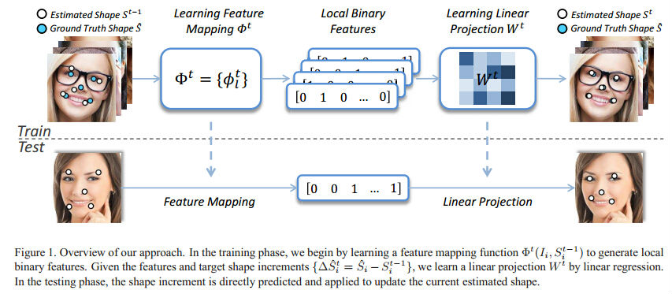

# **Face-alignment-at-3000FPS**

#### &emsp;&emsp;上一篇笔记讲到的两种方法在回归的过程中都是将整个shape同时进行两层回归器回归的，而文献[1]在上面方法的基础上，提出了先local后global的方法，即先对单个特征点用回归森林进行回归，然后将local回归结果用global结合起来。

#### &emsp;&emsp;3000FPS也是通过基于形状回归的双层回归特征点检测方法，从一个初始形状$$S^{0}$$逐层推测形状增量$$\delta S$$来预测形状。则，在第$$t$$次第一层回归得到的形状增量为：

 

 
 

 
#### &emsp;&emsp;其中$$I$$为输入图像，$$S^{t-1}$$为前一个第一层回归得到的形状，$$\phi ^{t}$$为特征映射函数，$$W^{t}$$为线性回归矩阵。$$\phi ^{t}$$又分解为一系列的独立的局部特征映射函数，如$$\phi ^{t}=[\varphi^{t}_{1}, \varphi^{t}_{2}, \cdots ,\varphi^{t}_{L}]$$, 其中$$L$$为特征点的个数，$$\varphi^{t}_{i}$$为单个landmark经过随机森林得到的局部特征映射。这里简单来说就是将每个特征点单独进行特征提取，将特征转换为局部二值特征，再将局部二值特征整合起来(拉成一列)，利用全局线性加权组合。实现过程如下图：

 
 

#### &emsp;&emsp;因此，这种方法是遵循先局部后全局的思想，下面分别讲述这两步具体过程。

#### **局部二值特征**

#### &emsp;&emsp;构建局部二值特征，也就是构建$$\phi ^{t}=[\varphi^{t}_{1}, \varphi^{t}_{2}, \cdots ,\varphi^{t}_{L}]$$的过程。对每个单独特征点的局部二值特征$$\varphi^{t}_{l}$$用随机回归森林进行学习。这里主要分为两步，一个是随机森林的训练，一个是二值特征映射。
- ####随机森林训练

#### &emsp;&emsp;随机森林的训练是从每棵树进行的。从根节点开始的，逐个节点开始训练，每个节点在训练过程中随机从训练样本中选取部分样本，比如305个样本。单个节点的训练过程为：对于单个节点，在搜索半径&&r&&内(搜索半径如下图所示)取特定数量的特征，比如1000个特征，则随机生成1000对半径和角度(取对是为了取像素差特征)。计算以landmark为中心点的周围的1000对偏移量和角度对应的图像灰度值的差作为这个landmark的1000个特征，下面需要做的是从这1000个偏移量中选择一个作为该节点的特征提取index。对一个特征偏移量从训练样本的灰度差特征中随机选取一个作为阈值，并利用这一阈值和训练样本的灰度差将训练样本分成左右子树。分别计算左右子树所有样本的$$\Delta S$$的方差。选取这1000个特征中能使$$\Delta S$$的方差达到最大的那个特征其所对应的偏移量和阈值作为该节点的特征提取index和阈值。其余的节点的训练方法相同。

 
 

#### &emsp;&emsp;局部区域半径的选择依赖于训练样本的$$\Delta S$$， 如果所有样本的$$\Delta S$$都分布的很宽很广，就要选用较大的半径，否则就要用较小的半径。

- #### 二值特征提取

#### &emsp;&emsp;假设每个特征点的森林里有10棵完全二叉树，假设每棵数有6层，则总共有$$2^{6}-1=63$$个节点，叶子节点有32个，则对于每一个特征点每一个样本只能到达一棵树的一个叶子节点，也就是这个样本的当前特征点在这颗树下的二值特征为32维，其中只有1个为1，其余全为0，由此构建可二值特征，那么当前样本的每个特征点在10棵树的森林下形成的二值特征为$$32*10$$维，其中为1的元素个数为每个森林中树的个数为10， 其余全为0。同理，若样本有18个特征点，每个特征点的二值特征的维数为32，则第二部全局线性回归时，将这些二值特征组合起来，形成18*32=576维稀疏二值特征$$\phi ^{t}$$，为1的个数为10(每个随机森林中二叉树的个数)，其余全为0.

#### **全局线性回归**

#### &emsp;&emsp;在上面过程中已经得到的单独特征点的二值特征$$\varphi^{t}_{l}$$，将其整合提来拉成一列，形成整体的二值特征$$\phi ^{t}=[\varphi^{t}_{1}, \varphi^{t}_{2}, \cdots ,\varphi^{t}_{L}]$$。可以通过线性回归求解全局权$$W$$。即如下的优化问题：

#### &emsp;&emsp;其中第一项为回归目标，第二项为2范数正则化，$$W^{t}$$为全局线性回归权值。不难看出，当模型训练好之后，权$$W^{t}$$就会固定，然后在测试过程中，只需要将权$$W^{t}$$和二值特征$$\phi ^{t}$$相乘，就可以得到预测shape。

#### &emsp;&emsp;这一方法中的先局部单个特征点进行回归，后全局线性回归能够给模型添加全局shape约束并且能够减少由于局部遮挡或模糊引起的局部误差。

#### **Reference**

#### [1] Ren S, Cao X, Wei Y, et al. **Face Alignment at 3000 FPS via Regressing Local Binary Features**[J].
