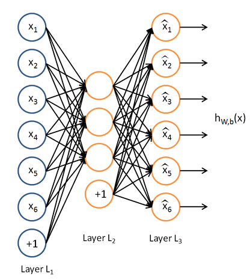

<table align="left">
    <h4 style="text-indent: 2em;"><a href= "../index.html">Deep-Learning</a></h4>
</table>

#**CNN预学习--CAE**

####&nbsp;&nbsp;&nbsp;&nbsp;这篇文章总结一下"Stacked convolutional auto-encoders for hierarchical feature extraction",利用堆叠卷积自编码预学习CNN。

####首先，回忆一下自编码。

####&nbsp;&nbsp;&nbsp;&nbsp;自编码神经网络是一种无监督学习算法，它使用了反向传播算法，并让目标值等于输入值。    

####自编码的过程即是寻找一对编码和解码的过程，实现输入数据的最大程度上的重构：     
$$
h=\sigma (Wx+b)
$$-----编码过程    
       
$$y'=\sigma (W'h+b')$$-----解码过程    
    
####其中$$y'$$是$$y$$的近似重构，$$W'$$为$$W$$的转置。

####去噪自编码即对输入图像添加噪声, 是为了能够提取到足够鲁棒的特征。(在自编码中效果比较好的是去噪自编码和稀疏自编码~)

####传统的自编码是1D形式，忽略了图像的2D结构，这里利用权值共享处理2D结构，保留了图像之间的空间结构。根据权值共享和局部感受野，自编码卷积网络可以表示为：

####编码过程：$$h^{k}={\underset{j}{\sum}}\sigma(W_{j}^{k}*x_{j}+b_{j}^{k})$$    (多个连接之和，上图为2)

####解码过程： $$\widehat{x}_{j}={\underset{k}{\sum}}\sigma(\widehat{W}_{j}^{k}*h^{k}+c_{j}^{k})$$    （$$k$$表示存在连接，上图全连接为3）
 
$$\widehat{W}_{j}^{k}$$是$$W_{j}^{k}$$的180度翻转。

####为了保证重构输出和输入的维数的匹配，在编码的过程中使用卷积用有效卷积，而在解码过程中使用全卷积。

####求解权值和偏置值参数的代价函数为：

$$E=\frac{1}{2N}\overset{N}{\underset{j=1}{\sum}}(x_{j}-\widehat{x}_{j})^{2}$$

####利用随机梯度下降法求解这一代价函数，求得权值$$W$$作为这一次的初始值。

###Reference
[1] Jonathan Masci, Stacked convolutional auto-encoders for hierarchical feature extraction,2010.