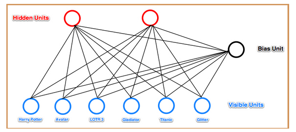
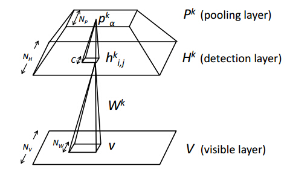

#**CNN预学习-CDBN**

####&nbsp;&nbsp;&nbsp;&nbsp;这篇文章来总结CNN预学习的第二种方法CDBN(Convolutional Deep Belief Networks). 

####&nbsp;&nbsp;&nbsp;&nbsp;(Restricted Boltzmann Machines, RBM)是一种双层的，无向图模型，包括可视层节点和隐层节点。传统的RBM是1D结构，如：

####&nbsp;&nbsp;&nbsp;&nbsp;传统的RBM的1D结构应用与图像处理时，会因为维数太大计算太过复杂(例如100x100的图像，输入层维数为10000个输入节点)。而且由于其忽略了图像的2D结构，使得图像中每个位置的权值都是分开单独计算的，这不仅造成计算量大，而且会产生冗余(图像中相邻位置中的权值可能相差不多，甚至可能是相同的)，这些原因造成了传统的RBM在应用于整幅图像上时面临挑战。

####&nbsp;&nbsp;&nbsp;&nbsp;CDBN的提出解决了上述传统RBM的局限。CDBN的结构如下：

####其中，输入层为维数$$N_{V}\times N_{N}$$的节点，隐层包含$$K$$个$$N_{H}\times N_{H}$$的group(每个group对应一个特征map)，每个group对应于一个$$N_{w}\times N_{w}$$的滤波。

####首先，初始化滤波和偏置值，由可视层和初始化的参数可以得到隐层值。利用能量函数的对数似然估计函数作为目标函数更新滤波和偏置。能量函数为：

####目标函数为：

$$
\underset{w,b,c}{\min} -\log P(v,h)
$$

####在这里，由于隐层有$$K$$个group(特征map),而每个group的维数和原始图像相差无几，这将造成隐层巨大的维数特征(例如：24个map，91x91维，则隐层的维数为24x91x91=198744)。而解决这一问题最常用的方法就是令隐层特征稀疏，换句话说，就是使隐层处于激活状态的节点只有少数。将这一约束添加到目标函数为：

$$
\underset{w,b,c}{\min} -\log P(v,h)+\lambda \overset{n}{\underset{j=1}{\sum}}\|p-E[h_{j}|v]\|^{2}
$$

####其中$$p$$为控制隐层节点$$h_{j}$$稀疏性的常数，$$E[\cdot]$$为条件期望。这一模型利用梯度下降法进行求解。

<!--####在卷积网络中，通常包含两部分结构，一部分是卷积层，一部分是pooling层。卷积层的目的是提取变换不变特征，而pooling层的目的是降低特征表示的维数减少计算量，并在最大程度上保持提取到的变换不变特征。-->

###Reference

####[1] Lee H, Grosse R, Ranganath R, et al. Convolutional deep belief networks for scalable unsupervised learning of hierarchical representations[C]//Proceedings of the 26th Annual International Conference on Machine Learning. ACM, 2009: 609-616.

####[2] Lee H, Ekanadham C, Ng A Y. Sparse deep belief net model for visual area V2[C]//Advances in neural information processing systems. 2008: 873-880.