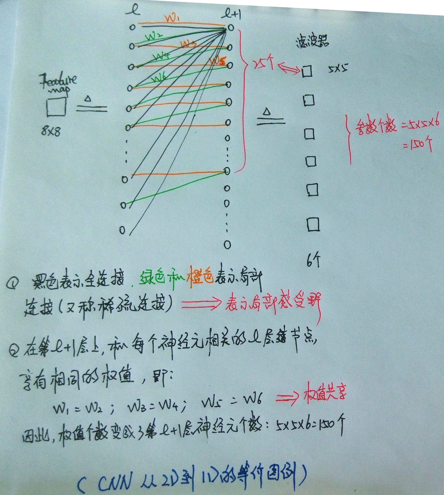
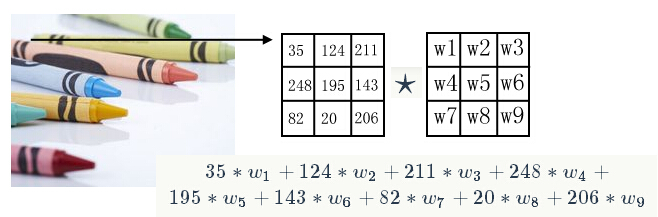
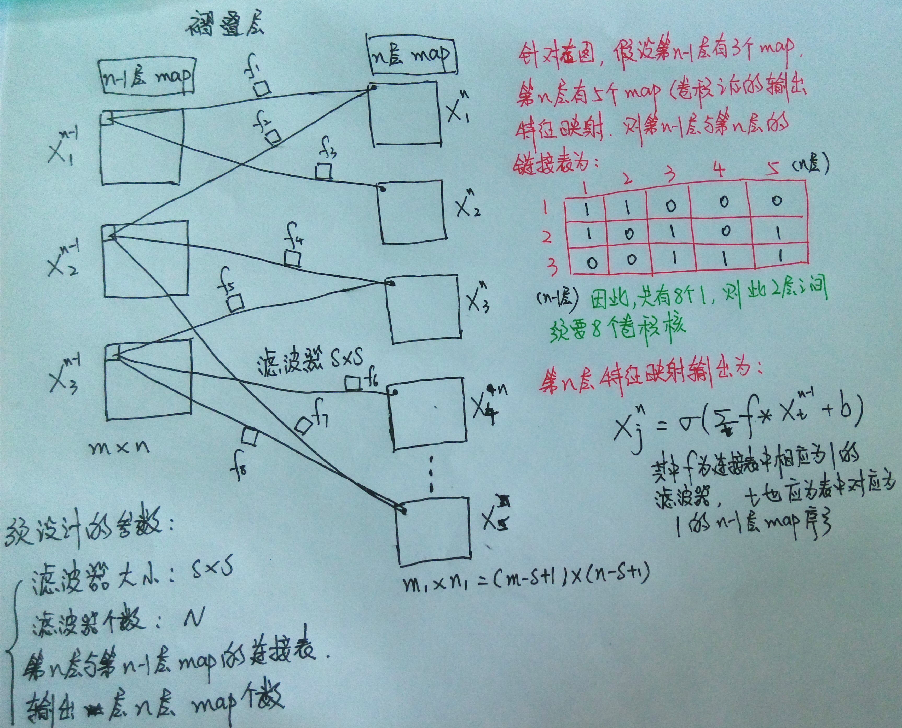
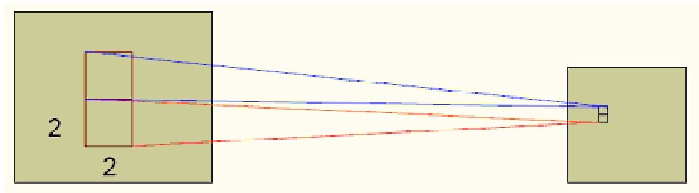
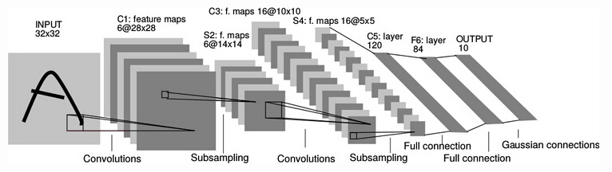

<table align="left">
    <h4 style="text-indent: 2em;"><a href= "../index.html">Deep-Learning</a></h4>
</table>

#**卷积神经网络(CNN)**

####在前面的博文中，我们讲到了，对于深度网络(Deep networks)，存在的问题主要有：
- 参数过多，需要大量的标记数据；
- 优化问题为非凸问题，解会陷入局部最小解；
- 梯度离散问题    

####而相应于上述的这三点问题，主要的解决思路有两种：
- 自编码/RBM+逐层学习----目的增加数据量
- CNN----减少参数数量

####这篇文章主要介绍第二种方法，卷积神经网络(CNN). 
   
###\*CNN概述 
   
###\*CNN结构

####1. CNN特点 
  
####卷积神经网络是一种特殊的深层的神经网络模型，这种网络结构对平移、比例缩放、倾斜或者共他形式的变形具有高度不变性。它的特殊性体现在两个方面，一方面它的神经元间的连接是非全连接的， 另一方面同一层中某些神经元之间的连接的权重是共享的（即相同的）。CNN最主要的特点是减少了权值的数量。 下图用2D到1D的等价表述了CNN的这两个特点：
 
   
####2. 2D卷积 
   
####在图像上，对图像用一个2D卷几何进行卷积运算，实际上是一个滤波过程。 
  
 
####3. 褶叠层  
  
####褶叠层的结构如下图所示：   
 
   
####4. 汇聚pooling  
 
####在通过卷积获得了特征 (features) 之后，下一步我们希望利用这些特征去做分类。理论上讲，人们可以用所有提取得到的特征去训练分类器，例如softmax分类器，但这样做面临计算量的挑战。例如：对于一个96X96像素的图像，假设我们已经学习得到了400个定义在8X8输入上的特征，每一个特征和图像卷积都会得到一个(96−8+1)*(96−8+1)=7921维的卷积特征，由于有400个特征，所以每个样例(example)都会得到一个892*400=3,168,400维的卷积特征向量。学习一个拥有超过3百万特征输入的分类器十分不便，并且容易出现过拟合(over-fitting)。    

    
####
输出= Sigmoid( 采样*权重 +偏移量)
 
 
####
sigmoid也可以是其他的非线性变换函数
 
  
###*CNN实例-LeNet5    
 
   
####具体过程参考（3. 褶叠层），这一过程便很容易理解了。 需要注意的是每个褶叠层输出的特征map个数，还有与上一层map的连接情况（这些连接情况决定了需要学习的滤波核的个数）都是经过经验设定的，这些结构变化便使得网络产生不同的变化。  
 
###*反向传播求解权值 
  
####一旦CNN的结构建立完毕，则CNN就变成了普通的多层神经网络，其参数的求解用反向传播求解。 
  

###*Reference   

####[1] Krizhevsky A, Sutskever I, Hinton G E. Imagenet classification with deep convolutional neural networks[C]//Advances in neural information processing systems. 2012: 1097-1105.  
 
####[2] LeCun Y, Bottou L, Bengio Y, et al. Gradient-based learning applied to document recognition[J]. Proceedings of the IEEE, 1998, 86(11): 2278-2324.
