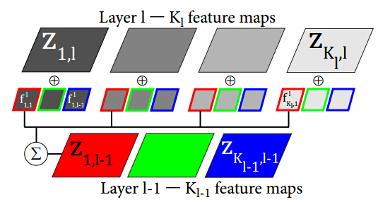
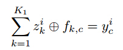
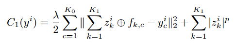

# **反卷积网络(Deconvolution network,DC)**

#### &nbsp;&nbsp;&nbsp;&nbsp;深度网络结构是由多个单层网络叠加而成的，而常见的单层网络按照编码解码情况可以分为下面3类：

- 既有encoder部分也有decoder部分：比如常见的RBM系列（由RBM可构成的DBM, DBN等），autoencoder系列(以及由其扩展的sparse autoencoder, denoise autoencoder, contractive autoencoder, saturating autoencoder等)。

- 只包含decoder部分：比如sparse coding, 和deconvolution network.

- 只包含encoder部分，那就是普通的feed-forward network,CNN.

### 反卷积定义：

#### &nbsp;&nbsp;&nbsp;&nbsp;假设A=B*C 表示的是：B和C的卷积是A，也就是说已知B和C，求A这一过程叫做卷积。那么如果已知A和B求C或者已知A和C求B，则这个过程就叫做反卷积，deconvolution。

#### &nbsp;&nbsp;&nbsp;&nbsp;Deconvolution network是和convolution network(CNN)对应的，在CNN中，是由input image卷积feature filter得到feature map, 是一个从bottom-top的过程。而在devonvolution network中，是由feature map卷积feature filter得到input image， 是一个从top-bottom的过程。

### 反卷积网络的目的是：利用图像先验知识，同时计算出卷积滤波和特征映射。

#### DC的结构图如下：
 

#### 反卷积公式为

#### 目标代价函数为：

