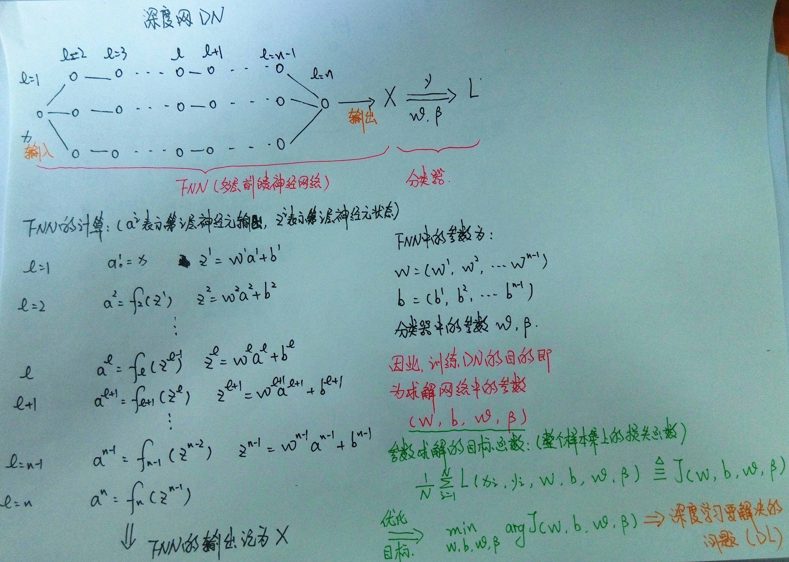

#**深度网络和深度学习**

 
####&nbsp;&nbsp;&nbsp;&nbsp;在上述图片中描述了一个深度网络的构成结构和其中的参数问题，Deep Learning（DL）从本质上来说就是求解deep network （DN）中的参数问题。在求解参数的优化目标时，通常用的方法有随机梯度下降法和梯度下降法，需要求所有参数的偏导数。
   
####&nbsp;&nbsp;&nbsp;&nbsp;由上图中描述中，我们可以看到DL存在的问题：   
- <h4>需要求解的参数太多（假设第L层和第L+1层分别有150个神经元，则其全连接全W参数个数为150*150=22500）；在使用梯度下降法或随机梯度下降法求解参数时，需要构建损失函数，这里就会需要大量的标记数据，层数越多，需要标记的数据就会越多；当样本数量不足时，会导致参数个数大于样本个数，这会导致过拟合现象。</h4>   
- <h4>神经网络的训练函数是非凸函数，这将导致优化目标函数可能会收敛到局部极小值解。</h4>
- <h4>深度神经网络若采用传统的反向传播调整参数，会遇到梯度离散问题即导数消亡问题，这会导致越靠近输入端的网络更容易陷入局部最小解，甚至几乎更难调动权值。</h4>  

####针对DL存在的上述问题，现有的改进方法主要有两类：  
 
####1. 添加无监督预训练学习初始化参数，以此来代替随机初始化参数。目的是使得预学习得到的参数能够在最优解附近，这样在反向传播调整参数过程中只要轻微调整学习到的参数，就能最大程度上接近全局最小解。换句话说，即使在反向传播过程中，在靠近输入端只能进行轻微调动，对于预学习得到的最优解附近的参数也足够了。   

####&nbsp;&nbsp;&nbsp;&nbsp;无监督预学习主要的方法为：自编码+逐层学习 （这一类方法在后面博文中会单独描述）
   
####2. 针对DN中参数过多问题，还可以用压缩参数减少参数量的方法解决。
  
####&nbsp;&nbsp;&nbsp;&nbsp;这类方法主要是：CNN（在后面博文中会单独描述）

