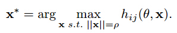

# **神经网络可视化**

#### &nbsp;&nbsp;&nbsp;&nbsp;当我们训练完一个深度模型后，我们还特别想把这个深度模型学到的东西给可视化出来，好弄明白它到底学到了什么东西，是不是有意义的, 提取到的是什么特征，如果是例如边缘，到形状，到目标等等，那就证明网络搭建是正确的。

#### &nbsp;&nbsp;&nbsp;&nbsp;对于神经网络中权值的可视化问题，第一层的权值是较为容易实现的，即为学习得到的特征，而对于第二层网络权值的可视化在一定程度是是困难的，因为输入层和第二层节点之间是非线性关系。

#### &nbsp;&nbsp;&nbsp;&nbsp;对于神经网络中的可视化主要有下面几种方法实现：

#### 1.将数据集中使得第二层节点激活最大的前k个训练样本，求平均值；

#### 2.使用优化算法求解使得第二层节点激活最大的输入；

#### &nbsp;&nbsp;&nbsp;&nbsp;假设某个神经元是提取这个特征的，那么如果这个图像满足这个特征（可以理解为和它很相似），那么神经元的输出就很大。在模板卷积，如果某个卷积模板与图像中模块越相似，那么响应就越大。某个图像输入使得这个神经元输出激励值最大，那么这个神经元就是提取了和这个输入差不多的特征。所以寻找可以使这个神经元输入最大的那个x就是我们可以可视化并且有意义的表达这个神经元学习到的特征。用数学公式表达为：

#### &nbsp;&nbsp;&nbsp;&nbsp;[http://ai.stanford.edu/~quocle/TCNNweb/index.html](http://ai.stanford.edu/~quocle/TCNNweb/index.html)

#### 3.设置第二层的大部分节点为0，只有一个节点为1，从第一层和输入层中采样，看满足什么分布；

#### &nbsp;&nbsp;&nbsp;&nbsp;块Gibbs采样方法, 例如在DBN中，我们从层j-1一直执行top-down采样一直到输入层。这样就会产生一个分布pj(x|hij=1)。用分布pj(x|hij=1)来描述hij，

#### 4.显示部分第一层的滤波，并按照与第二层节点的的链接强弱排序；

#### 5.使用第二层节点的权值对第一层不同节点的权值加权线性组合。

#### &nbsp;&nbsp;&nbsp;&nbsp;例如，将第一层的权值第二层的部分权值子集进行相乘。在pylearn2/scripts/dbm/top_filters.py中显示了第一层和第二层权值的乘积，并显示了第一层和第二层每个节点的强连接情况。

#### 利用这几种不同的方法得到的结果是不相同的。

#### **实验结果**

#### 用hinton的RBM逐层学习方法在手写体识别字体上进行3层RBM训练，样本维数为28x28，因此，输入层节点为784，第二层隐层节点为1000，第三层隐层节点为500，第三层隐层节点为250.

#### 利用线性组合方法进行权值可视化：第一层输入层为784，第二层隐层为1000，因此之间的权值维数为784x1000.用这一权值矩阵左乘未白化的样本矩阵得到了784x1000的权值滤波，滤波维数为28x28，个数为1000个，如下图所示：

#### 第二层隐层有1000个节点，第三层隐层有500个节点，因此之间的权值矩阵为1000x500，这层权值滤波个数为500个，每一个的可视化计算为：假设要计算第i个权值可视化,将第二层隐层和这个节点相连接的节点的权值从大到小排序，取前k个最大值，这k个最大的第二层节点对应的可视化滤波和这k个最大值的加权和，即为第三层这第i个节点的权值可视化，依次计算其他的滤波，结果如下图所示：

#### 依次类推，第四层有250个节点，每个可视化滤波输入为当前节点的前k个最大的链接权值对应的前一次的滤波的加权和，结果图如下：

#### **Reference**

#### [1] [https://groups.google.com/forum/#!topic/pylearn-dev/rWeyD1VgJ_Y](https://groups.google.com/forum/#!topic/pylearn-dev/rWeyD1VgJ_Y)

#### [2] Lee H, Ekanadham C, Ng A Y. Sparse deep belief net model for visual area V2[C]//Advances in neural information processing systems. 2008: 873-880.

#### [3] Lee H, Grosse R, Ranganath R, et al. Convolutional deep belief networks for scalable unsupervised learning of hierarchical representations[C]//Proceedings of the 26th Annual International Conference on Machine Learning. ACM, 2009: 609-616.

#### [4] Zeiler M D, Fergus R. Visualizing and understanding convolutional networks[M]//Computer Vision–ECCV 2014. Springer International Publishing, 2014: 818-833.

#### [5] Erhan D, Bengio Y, Courville A, et al. Visualizing higher-layer features of a deep network[J]. Dept. IRO, Université de Montréal, Tech. Rep, 2009.
